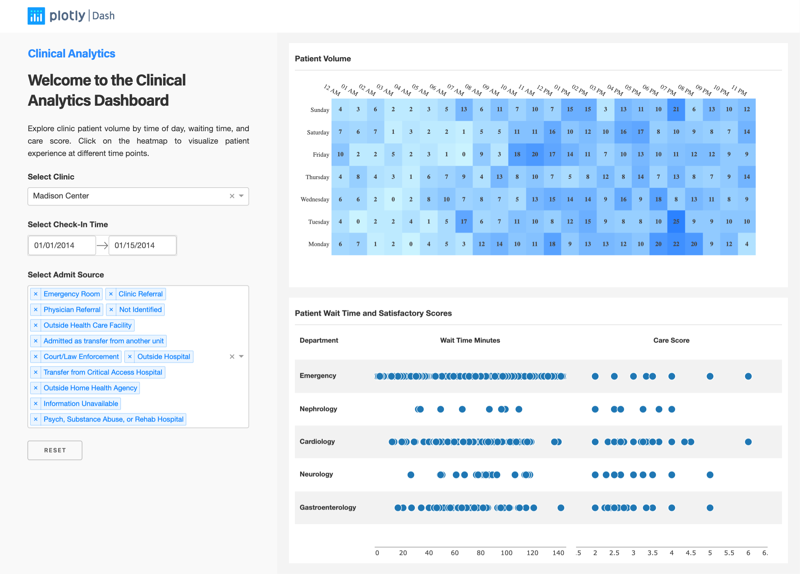

# dash-clinical-analytics

## Sobre este app

Este dashboard permite que você explore o volume de pacientes na clínica por hora do dia, tempo de espera e pontuação de atendimento. Aprofunde-se em dias de alto volume para ver como o ambiente movimentado pode ter afetado a experiência do paciente.

## Requisitos

* Python 3

## Como executar este app

Sugerimos que você crie um ambiente virtual para executar este app com Python 3. Clone este repositório e abra o seu terminal/prompt de comando na pasta raiz.

```
git clone https://github.com/plotly/dash-sample-apps
cd dash-sample-apps/apps/dash-clinical-analytics
python3 -m virtualenv venv

```
Em sistemas Unix::
```
source venv/bin/activate

```
No Windows: 

```
venv\Scripts\activate
```


Instale todos os pacotes necessários executando:

```
pip install -r requirements.txt
```


Execute este app localmente com:
```
python app.py
```

## Captura de tela



## Recursos

* [Dash](https://dash.plot.ly/)
* Inspirado pelo  [Tableau template](https://www.tableau.com/solutions/workbook/improve-patient-satisfaction-improving-cycle-time).
